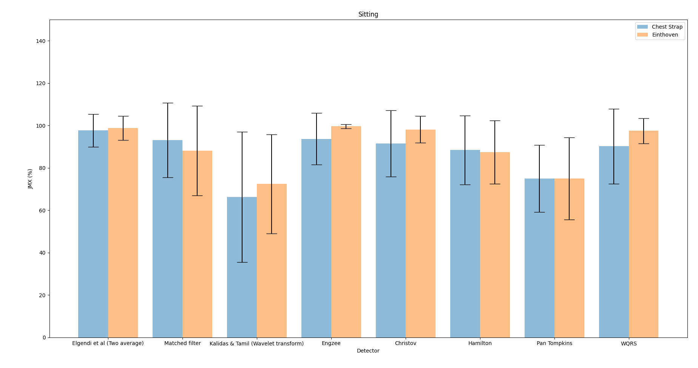
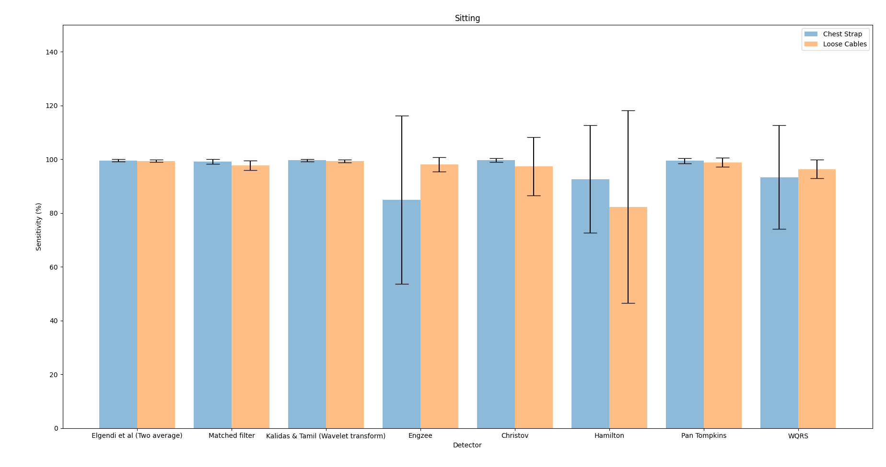

# JMX Benchmark Analysis for heartbeat detectors

A benchmarking analysis method that generates an overall benchmark for
ECG detector algorithms, based on measurements of temporal jitter (J),
missed beats (M) and extra detections (X), as these are the three ways
errors show up independent of the source of the error. The Glasgow
University GUDB ECG recordings database ([Howell and Porr,
2018](http://dx.doi.org/10.5525/gla.researchdata.716)) is used for
testing as it has annotated R-peaks for reference. The detector
algorithms are tested using recordings for all subjects, all
exercises, and Einthoven II and chest strap leads (Einthoven I and
Einthoven III can additionally be used if desired).

The benchmark gives a score between 0-100 where 100 is defined as the
ideal detector. The ideal detector has no extra beats, no missed
beats, and a mean absolute deviation (MAD) of zero for temporal jitter
when using our interval analysis method. The benchmark is independent
of application-specific performance to truly represent an overall
score that can be compared across applications encompassing all the
ways errors show up in ECG heartbeat detection.

## Prerequisites

Install `py-ecg-detectors` ([Howell and Porr, 2019](https://doi.org/10.5281/zenodo.3353396)).

Linux / Mac:
```
pip3 install py-ecg-detectors [--user]
```
Windows:
```
pip install py-ecg-detectors [--user]
```
From source:
```
python3 setup.py install [--user]
```
*Use the option --user if you don't have system-wise write permission.*

---
Install ecg_gudb_database ([Howell and Porr, 2018](https://pypi.org/project/ecg-gudb-database/)) via the package manager [pip](https://pip.pypa.io/en/stable/) or pip3 which is a version of the pip installer for Python3.

```bash
pip install ecg_gudb_database
pip3 install ecg_gudb_database
```

---
Download the templates file and the folder is placed within the working directory. As well as individualised templates it includes the default templates for 250Hz and 360Hz.

## Usage

### jmx_analysis.py

JMX analysis of interval variation, missed beat and extra detection positions:

```
evaluate(det_posn, anno_R, fs, nSamples, trim=True)
```

Arguments:

    - det_posn: the timestamps of the detector in sample positions
    - anno_R: the ground truth in samples
    - fs: sampling rate of the ECG file
    - nSamples: number of samples in the ECG file
    - trim: trims 2 detections from start/end of det_posn/anno_R


Returns:

    - jmx[key_jitter]   : jitter in s
    - jmx[key_tp]       : true positive beats
    - jmx[key_tn]       : true negative beats
    - jmx[key_fp]       : false positive beats
    - jmx[key_fn]       : false negative beats
    - jmx[key_accuracy] : accuracy
    - jmx[key_jmx]      : JMX Score


### jmx_evaluate_all_detectors.py

The code evaluates all ECG detectors with all subjects, all leads, and all
experiments. It outputs separate json files for every detector and stores
them in the `results` directory.

### jmx_stats_plots.py

The overall JMX Benchmark values for Einthoven
II and chest strap results are shown together on a bar graph for
comparison for sitting and jogging.



# Traditional sensitivity analysis

For a sensitivity analysis on an `fs/10` samples temporal window run:

```
python sensitivity_evaluate_all_detectors.py
python sensitivity_stats_plots.py
```



Note that a pure sensitivity analysis on a wide temporal window
yields mostly 99-100% sensitivity.

# Credit

 - Eleanor Forsyth
 - Bernd Porr <bernd.porr@glasgow.ac.uk>
